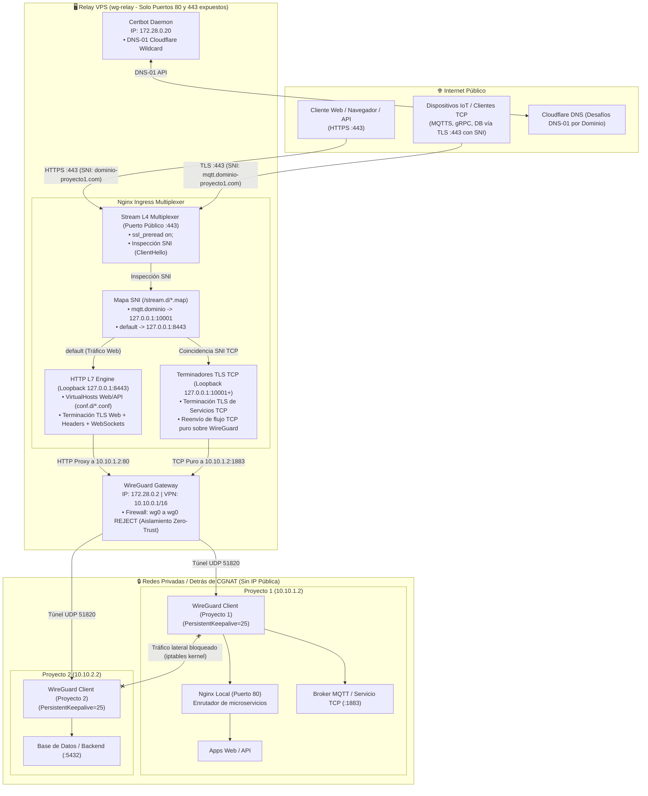

# wg-relay

> **VPS Ingress Relay & Reverse Proxy Multi-Proyecto Modular con WireGuard, Nginx y Certbot (Cloudflare DNS-01).**

`wg-relay` es una solución contenerizada y lista para producción que convierte uno o más VPS públicos en gateways de entrada (*ingress proxies*) con terminación TLS centralizada. Permite exponer hacia Internet servicios web (HTTP/HTTPS) y servicios TCP con o sin TLS (MQTTS/MQTT, bases de datos, APIs de sockets o flujos de telemetría IoT) alojados en redes privadas locales detrás de **CGNAT** (sin IP pública ni apertura de puertos), garantizando un **aislamiento perimetral estricto (Zero-Trust L3)** entre proyectos.

---

## Índice

1. [Arquitectura del Sistema](#arquitectura-del-sistema)
2. [Estructura del Repositorio](#estructura-del-repositorio)
3. [Requisitos Previos](#requisitos-previos)
4. [Despliegue Inicial en un VPS Limpio](#despliegue-inicial-en-un-vps-limpio)
5. [Flujo de Trabajo: Agregar un Nuevo Proyecto](#flujo-de-trabajo-agregar-un-nuevo-proyecto)
6. [Aislamiento de Red y Seguridad (iptables)](#aislamiento-de-red-y-seguridad-iptables)
7. [Alta Disponibilidad y Redundancia Multi-VPS](#alta-disponibilidad-y-redundancia-multi-vps)
8. [Comandos de Operación y Mantenimiento](#comandos-de-operación-y-mantenimiento)

---

## Arquitectura del Sistema



---

## Estructura del Repositorio

```
wg-relay/
├── .env.example                        # Plantilla de variables de entorno globales
├── .gitignore                           # Exclusión de secretos, claves y certificados
├── docker-compose.yml                  # Definición de servicios (wireguard, nginx, certbot)
├── README.md                           # Documentación completa y manual de operaciones
├── certbot/
│   ├── cloudflare.ini.example          # Plantilla del Token de API de Cloudflare
│   └── init-cert.sh                    # Script de solicitud inicial de certificado Wildcard
├── templates/                          # 📁 Plantillas declarativas maestras para new-project.sh
│   ├── wireguard/
│   │   └── peer.conf.template          # Plantilla para peers modulares WireGuard
│   └── nginx/
│       ├── vhost.conf.template         # Plantilla L7 Ingress (VirtualHost HTTPS/HTTP)
│       ├── sni.map.template            # Plantilla para reglas SNI en puerto 443
│       └── terminator.conf.template    # Plantilla de terminador TLS L4 interno
├── nginx/
│   ├── nginx.conf                      # Configuración base con SNI Preread Multiplexer en puerto 443
│   ├── conf.d/                         # VirtualHosts L7 activos generados dinámicamente (.gitkeep)
│   └── stream.d/                       # Mapeos SNI y terminadores TLS activos (.gitkeep)
│       └── 00-base.map                 # Mapa base para evitar fallos de include
├── wireguard/
│   ├── assemble.sh                     # Compilador idempotente de peers y sync en caliente
│   ├── templates/
│   │   └── interface.conf              # Configuración base wg0 + reglas de firewall iptables
│   └── peers.d/                        # Peers WireGuard modulares activos (.gitkeep)
├── scripts/
│   ├── new-project.sh                  # Asistente ALL-IN-ONE: autoasigna IP, compila templates, valida SSL y recarga
│   ├── add-peer.sh                     # Asistente rápido para registrar peers WireGuard (reutiliza templates)
│   └── reload.sh                       # Recarga en caliente sin downtime (Nginx + WireGuard)
└── examples/
    └── client-project/                 # Plantilla completa para correr en el servidor local (CGNAT)
        ├── docker-compose.yml          # Stack local (WireGuard + Nginx Local + Apps)
        ├── README.md                   # Guía de despliegue local
        ├── wireguard/
        │   └── wg0.conf.example        # Configuración del túnel cliente hacia el VPS
        └── nginx/
            └── conf.d/
                └── default.conf        # Enrutamiento local de subdominios a contenedores
```

---

## Requisitos Previos

- **Servidor VPS:** 1 vCPU, 1 GB RAM con Linux (Ubuntu 22.04 LTS / 24.04 LTS o Debian 12 recomendados).
- **Dominio en Cloudflare:** Dominio administrado en Cloudflare con nameservers activos.
- **Docker Engine y Docker Compose:** Docker v24+ y Compose v2+.
- **Puertos del VPS abiertos en el Firewall del Proveedor:**
  - `80/TCP` (HTTP Ingress / Redirección HTTPS)
  - `443/TCP` (HTTPS & TCP TLS Ingress Multiplexado por SNI - ¡Un solo puerto para todo!)
  - `51820/UDP` (WireGuard VPN Handshake)

---

## Despliegue Inicial en un VPS Limpio

### Paso 1: Preparación del Servidor

Conéctate al VPS por SSH y asegúrate de tener el kernel y Docker al día:

```bash
# Actualizar el sistema e instalar utilidades básicas
sudo apt update && sudo apt upgrade -y
sudo apt install -y curl git ufw wireguard-tools

# Instalar Docker oficial si aún no está instalado
curl -fsSL https://get.docker.com | sudo sh
sudo usermod -aG docker $USER

# Configurar Firewall UFW
sudo ufw default deny incoming
sudo ufw default allow outgoing
sudo ufw allow 22/tcp comment 'SSH'
sudo ufw allow 80/tcp comment 'HTTP Ingress'
sudo ufw allow 443/tcp comment 'HTTPS & TLS Stream Multiplexer (Web y TCP)'
sudo ufw allow 51820/udp comment 'WireGuard VPN'
sudo ufw enable
```

> **Nota:** Cierra y vuelve a abrir tu sesión SSH si acabas de agregar tu usuario al grupo `docker`.

### Paso 2: Clonar el Repositorio y Configurar Variables

```bash
git clone https://github.com/tu-usuario/wg-relay.git
cd wg-relay

# Configurar variables de entorno
cp .env.example .env
nano .env
```

Ajusta al menos:

- `VPS_ENDPOINT_HOST`: La IP pública o nombre de host de tu VPS (ej. `203.0.113.1` o `vps.tuempresa.com`), usada por los clientes WireGuard para conectarse.
- `CERTBOT_EMAIL`: Tu correo para notificaciones de expiración de Let's Encrypt.

### Paso 3: Configurar Credenciales de Cloudflare

Crea un **API Token** en Cloudflare:

1. Dirígete a [Cloudflare Dashboard -> My Profile -> API Tokens](https://dash.cloudflare.com/profile/api-tokens).
2. Haz clic en **Create Token** -> **Create Custom Token**.
3. Permisos: `Zone` -> `DNS` -> `Edit`.
4. Zone Resources: `Include` -> `All zones` (o selecciona las zonas de tus proyectos).
5. Copia el token generado y configúralo:

```bash
cp certbot/cloudflare.ini.example certbot/cloudflare.ini
nano certbot/cloudflare.ini
```

Pega el token:

```ini
dns_cloudflare_api_token = TU_TOKEN_DE_CLOUDFLARE_AQUI
```

Asegura permisos estrictos:

```bash
chmod 600 certbot/cloudflare.ini
```

### Paso 4: Emitir el Certificado para el Dominio de tu Primer Proyecto

Ejecuta el script indicando el dominio específico del proyecto:

```bash
chmod +x certbot/init-cert.sh wireguard/assemble.sh scripts/*.sh
./certbot/init-cert.sh dominio-proyecto1.com #Opcional
```

El script verificará el token con Cloudflare, creará el registro TXT temporal `_acme-challenge` y guardará los certificados en `certbot/conf/live/dominio-proyecto1.com/` cubriendo tanto `dominio-proyecto1.com` como `*.dominio-proyecto1.com`. Puedes repetir este comando en cualquier momento para agregar nuevos proyectos con dominios totalmente diferentes.

### Paso 5: Iniciar los Servicios Base

```bash
docker compose up -d
```

Verifica que todos los contenedores estén en estado saludable:

```bash
docker compose ps
```

---

### Flujo de Trabajo: Alta Automatizada de un Nuevo Proyecto

Para incorporar cualquier proyecto nuevo a la red y exponer sus servicios, solo necesitas ejecutar el asistente automatizado:

```bash
./scripts/new-project.sh [nombre_proyecto] [dominio_base]
```

**Ejemplo interactivo:**
```bash
./scripts/new-project.sh sensorhub sensorhub.andy.net.ar
```

#### ¿Qué hace el asistente automáticamente?

1. **Auto-asignación de IP en la VPN (`10.10.x.y`):**
   - Inspecciona los archivos existentes y asigna automáticamente la siguiente IP secuencial disponible (ej. `10.10.1.2`, `10.10.1.3`...).
   - Genera las llaves criptográficas del cliente y compila el peer desde `templates/wireguard/peer.conf.template`:
     `wireguard/peers.d/<IP>-<proyecto>.conf` (ej. `10.10.1.2-sensorhub.conf`).
2. **Generación del Ingress L7 en Nginx:**
   - Compila `templates/nginx/vhost.conf.template` generando `nginx/conf.d/<IP>-<dominio>.conf` (ej. `10.10.1.2-sensorhub.andy.net.ar.conf`).
   - Configura la regla comodín (`server_name <dominio> *.<dominio>`) delegando todo el tráfico HTTP/HTTPS hacia `http://<IP>:80` con preservación del encabezado `Host $host`.
3. **Configuración Opcional de TCP Stream con TLS en Puerto 443 (MQTTS, DB, gRPC, Sockets):**
   - El script te pregunta si deseas habilitar un proxy TCP multiplexado por SNI para este proyecto.
   - De ser afirmativo, solicita el subdominio que usará tu servicio (ej. `mqtt.sensorhub.andy.net.ar` o `tcp.sensorhub.andy.net.ar`).
   - Solicita el puerto interno del contenedor/servicio remoto (ej. `1883` para MQTT o `5432` para PostgreSQL).
   - Asigna un puerto de loopback interno (`10001..20000`, ej. `10001`) que **nunca se expone públicamente**.
   - Compila desde `templates/nginx/sni.map.template` y `templates/nginx/terminator.conf.template`:
     - `nginx/stream.d/<IP>-<dominio>.map`: Regla SNI que redirige ese subdominio a `127.0.0.1:10001`.
     - `nginx/stream.d/<IP>-<dominio>.conf`: Terminador TLS interno que descifra el tráfico y lo envía vía WireGuard hacia `<IP>:<puerto_interno>`.
   - **Ventaja:** Tanto el tráfico Web (HTTPS) como el servicio TCP (MQTTS, gRPC) ingresan **por el mismo puerto 443**. ¡No requiere abrir puertos adicionales en ningún firewall!
4. **Validación de Certificados TLS:**
   - Comprueba si el certificado para ese dominio ya existe en `certbot/conf/live/<dominio>/`.
   - Si no existe, te ofrece emitir el certificado comodín con Cloudflare DNS-01 en ese mismo instante.
5. **Sincronización en Caliente:**
   - Ejecuta `./scripts/reload.sh` sincronizando WireGuard (`wg syncconf`) y recargando Nginx (`nginx -s reload`) con **cero downtime**.
6. **Entrega de Configuración para el Cliente Remoto:**
   - Imprime en pantalla el bloque listo para pegar en el cliente (`/etc/wireguard/wg0.conf`).

---

### Configurar el Nodo Local (Detrás de CGNAT)

En el servidor local, Raspberry Pi o máquina donde corre tu proyecto:

1. Copia la carpeta de plantilla [`examples/client-project/`](examples/client-project/):
   ```bash
   cp -r examples/client-project /ruta/a/mi-proyecto
   cd /ruta/a/mi-proyecto
   ```
2. Configura `/wireguard/wg0.conf` con el bloque de claves y la IP entregada por `new-project.sh`:
   ```ini
   [Interface]
   PrivateKey = <CLAVE_PRIVADA_GENERADA>
   Address = 10.10.1.2/16

   [Peer]
   PublicKey = <CLAVE_PUBLICA_DEL_VPS>
   Endpoint = <IP_O_HOST_DEL_VPS>:51820
   AllowedIPs = 10.10.0.0/16
   PersistentKeepalive = 25
   ```
   > [!IMPORTANT]
   > **`PersistentKeepalive = 25`** es mandatorio para mantener abierto el túnel saliente a través del CGNAT.

3. Levanta el stack local con WireGuard y Nginx local:
   ```bash
   docker compose up -d
   ```
4. Ya puedes acceder desde Internet a:
   - **Web / API:** `https://<dominio>` y `https://*.<dominio>` (Puerto 443)
   - **TCP Stream con TLS:** `<subdominio_tcp>:443` (ej. `mqtt.sensorhub.andy.net.ar:443`, MQTTS / gRPC / DB vía TLS en puerto estándar 443)

---

## Aislamiento de Red y Seguridad (Directivas Nativas de WireGuard)

Todo el aislamiento y las reglas de seguridad son **100% declarativas y están versionadas en Git**. No necesitas configurar iptables manualmente en el sistema operativo del VPS.

En el archivo [`wireguard/templates/interface.conf`](wireguard/templates/interface.conf), la herramienta nativa `wg-quick` ejecuta automáticamente directivas `PostUp` dentro del contenedor cada vez que levanta la interfaz `wg0`:

```ini
# 1. BLOQUEO LATERAL ABSOLUTO (Ejecutado automáticamente por WireGuard al arrancar)
PostUp = iptables -I FORWARD -i wg0 -o wg0 -j REJECT

# 2. ACCESO PERMITIDO SOLO DESDE EL REVERSE PROXY
PostUp = iptables -A FORWARD -i eth0 -o wg0 -j ACCEPT
PostUp = iptables -A FORWARD -i wg0 -o eth0 -m conntrack --ctstate RELATED,ESTABLISHED -j ACCEPT

# 3. MASQUERADE (Retorno transparente a través del túnel)
PostUp = iptables -t nat -A POSTROUTING -o wg0 -j MASQUERADE
```

> [!NOTE]
> Gracias a que estas reglas residen en la plantilla de WireGuard de este repositorio, el VPS es completamente **stateless**. Si clonas este repositorio en un segundo servidor y ejecutas `docker compose up -d`, la seguridad y el aislamiento perimetral se aplican de forma inmediata sin pasos manuales.

### ¿Cómo funciona el flujo de paquetes?

1. **Cliente Externo -> Servicio del Proyecto 1:**
   El usuario o dispositivo se conecta a `https://dominio-proyecto1.com` o al puerto de su servicio TCP. Nginx (en `172.28.0.10`) procesa el TLS y envía la petición hacia `10.10.1.2`. El kernel del contenedor Nginx sigue la ruta estática hacia la IP de WireGuard (`172.28.0.2`), ingresando a la interfaz `eth0` de WireGuard y reenviándose por el túnel `wg0` hacia el cliente.
2. **Tráfico entre Peers (Proyecto 1: 10.10.1.2 -> Proyecto 2: 10.10.2.2):**
   Si `10.10.1.2` intenta hacer ping o conectarse a `10.10.2.2`, el paquete entra por `wg0` y pretende salir por `wg0`. La regla `FORWARD -i wg0 -o wg0 -j REJECT` descarta y rechaza la conexión de forma inmediata.

---

## Alta Disponibilidad y Redundancia Multi-VPS

La arquitectura es completamente sin estado (*stateless*), lo que permite clonar el repositorio en un segundo VPS (`wg-relay-02`) para tolerancia a fallos:

```
                  +--------------------------------+
                  |  Cloudflare DNS / Load Balancer |
                  |    (ej. relay.tuempresa.com)   |
                  +---------------+----------------+
                                  |
               +------------------+------------------+
               | (Round Robin / Failover)            |
               v                                     v
      +-----------------+                   +-----------------+
      |  VPS 1 (Activo) |                   |  VPS 2 (Backup) |
      |  IP: 198.51.100.1 |                 |  IP: 203.0.113.1 |
      |  wg0: 10.10.0.1 |                   |  wg0: 10.20.0.1 |
      +--------+--------+                   +--------+--------+
               |                                     |
               +------------------+------------------+
                                  | (Túnel Dual)
                                  v
                    +---------------------------+
                    | Edge Gateway (Proyecto 1) |
                    | wg0 -> VPS 1              |
                    | wg1 -> VPS 2              |
                    +---------------------------+
```

### Pasos para replicar en un segundo VPS

1. **Clonar en el VPS 2:**
   Clona el repositorio en el nuevo servidor.
2. **Configurar `.env` en VPS 2:**
   Puedes usar una subred VPN separada para evitar conflictos (ej. `VPN_SUBNET=10.20.0.0/16` y `VPN_GATEWAY_IP=10.20.0.1`).
3. **Obtener Certificados en VPS 2:**
   Ejecuta `./certbot/init-cert.sh <dominio>` para cada dominio de tus proyectos.
4. **Configurar el Cliente Dual en el Edge:**
   En el dispositivo del cliente (ej. Edge Gateway del Proyecto 1), configura dos interfaces WireGuard:
   - `wg0.conf`: Conexión hacia VPS 1 (`10.10.1.2`).
   - `wg1.conf`: Conexión hacia VPS 2 (`10.20.1.2`).
5. **Configurar Cloudflare:**
   - **DNS Round Robin:** Agrega dos registros `A` para cada dominio o comodín (ej. `*.dominio-proyecto1.com`) apuntando a las IPs públicas de ambos VPS. Cloudflare distribuirá las peticiones entre ambos nodos automáticamente.
   - **Cloudflare Load Balancer:** Configura un monitor de salud (Health Check) HTTP/HTTPS en el endpoint `/healthz` de Nginx para conmutación por error automática (*Automatic Failover*) en menos de 5 segundos ante caídas de un centro de datos.

---

## Comandos de Operación y Mantenimiento

### Ver estado de conexiones y handshakes de WireGuard

```bash
docker compose exec wireguard wg show
```

### Ver logs de Nginx en tiempo real

```bash
docker compose logs -f nginx
```

### Ver logs del proxy de servicios TCP (L4 Stream / MQTTS)

```bash
docker compose exec nginx tail -f /var/log/nginx/stream_access.log
```

### Forzar renovación de certificados Let's Encrypt

Certbot renueva automáticamente todos los certificados emitidos en segundo plano cada 12 horas. Para forzar una renovación inmediata:

```bash
docker compose exec certbot certbot renew --force-renewal
./scripts/reload.sh --nginx-only
```

### Backup rápido de claves y certificados

```bash
tar -czvf wg-relay-backup-$(date +%F).tar.gz \
  .env \
  certbot/cloudflare.ini \
  certbot/conf/ \
  wireguard/config/ \
  wireguard/peers.d/ \
  nginx/conf.d/ \
  nginx/stream.d/
```
